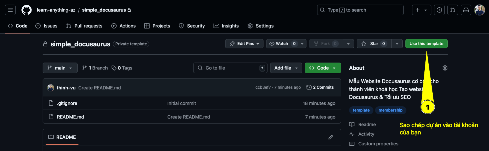
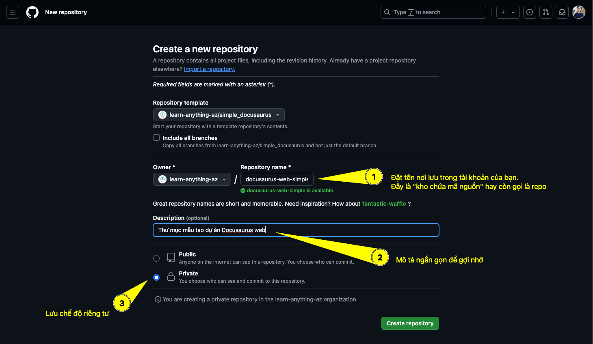
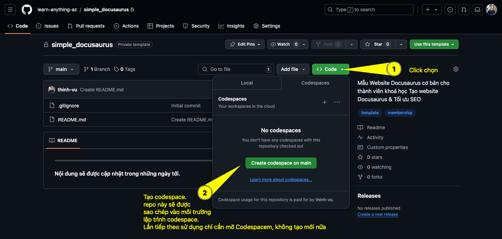
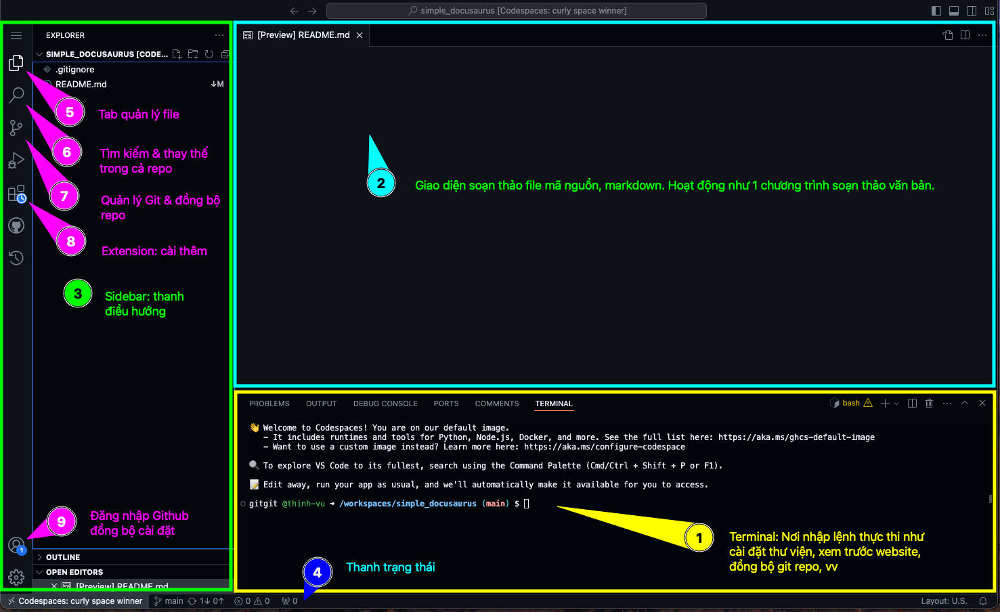
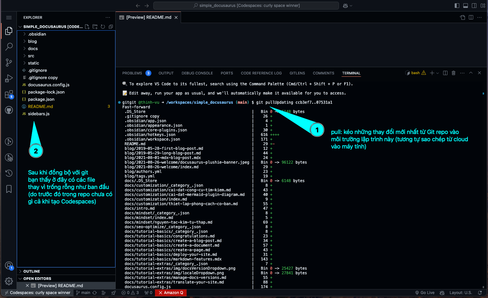
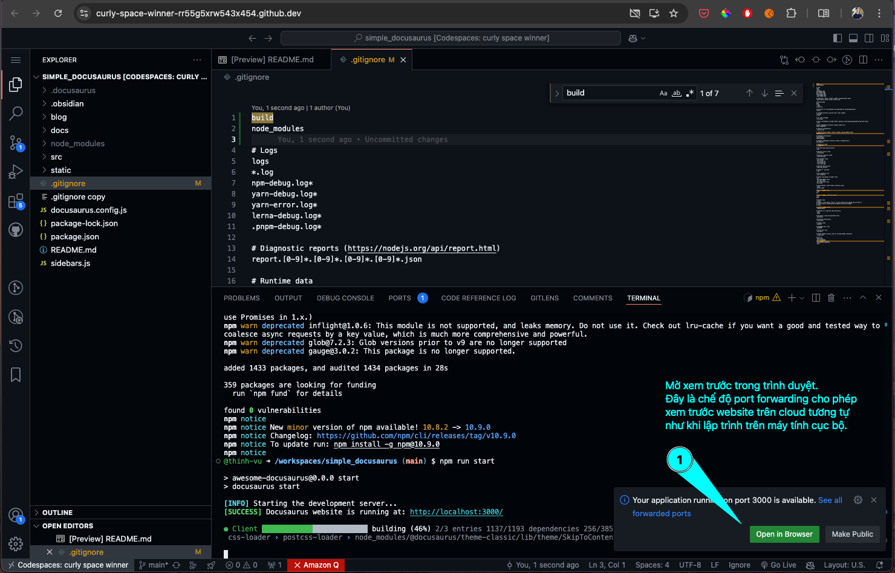
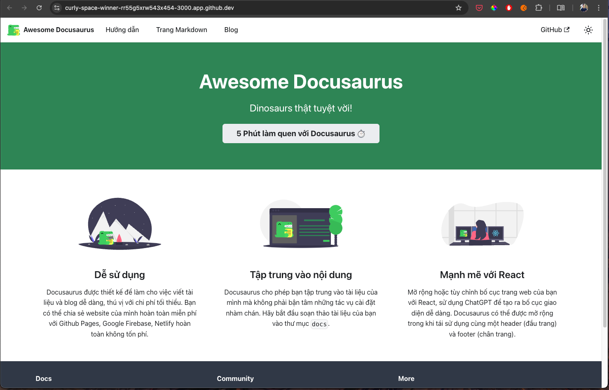
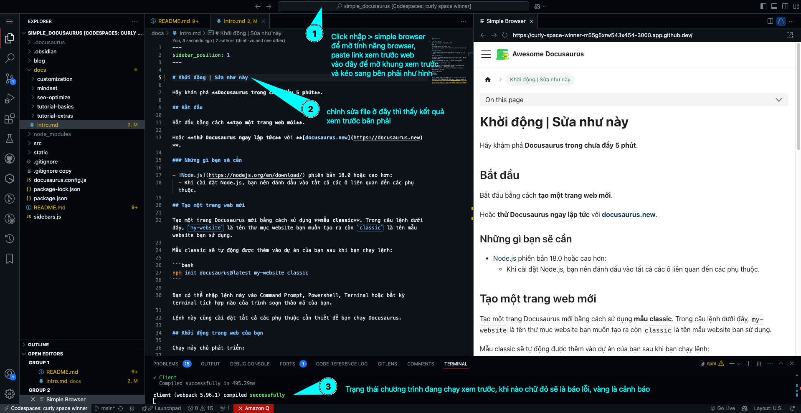
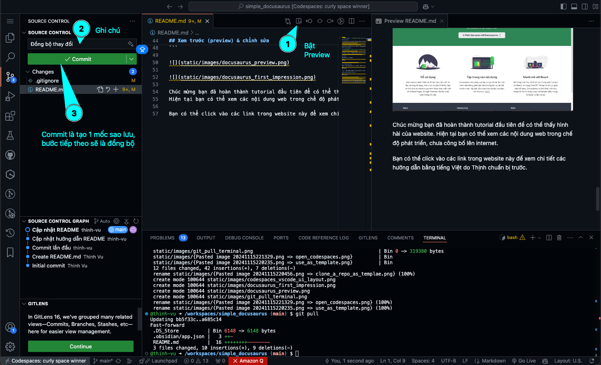
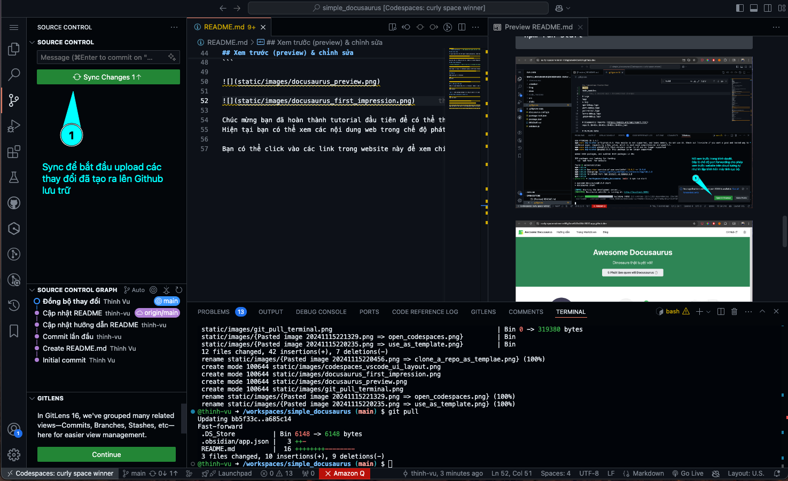

> [!TIP]
> `simple_docusaurus` là mẫu website đơn giản cho dự án Docusaurus kèm một số hướng dẫn cơ bản để minh hoạ tính năng website giúp bạn sử dụng nhanh chóng. Hãy sao chép dự án này về tài khoản của mình để bắt đầu thực hành.

## Sao chép repo

Từ giao diện kho chứa mã nguồn simple_docusaurus, chọn Use template để sao chép về tài khoản của bạn.





Sau khi lưu các thông tin mô tả, **bấm nút Create Repository** để tạo bản sao repo lưu trên tài khoản Github của bạn.

## Mở trong Codespaces

> Github Codespaces là dịch vụ đám mây của Github cho phép bạn sử dụng môi trường thiết lập sẵn để lập trình, chỉnh sửa cấu hình website và thay đổi nội dung của trang web được thực hiện trong môi trường này. Mặc định bạn được sử dụng miễn phí 60h/tháng cho dịch vụ này, mua gói Pro của Github giá $4 khoảng 110K sẽ cho phép sử dụng 180h/tháng khá thoải mái. Khi bạn đã quen các thao tác cơ bản có thể tự thiết lập môi trường lập trình trên môi trường cục bộ máy tính của mình để khỏi trả tiền phí.



Giao diện làm việc của Codespace giống y như Visual Studio Code, chỉ khác là chạy trên môi trường máy chủ đám mây chứ không phải Desktop cục bộ trên phần cứng máy tính của bạn.



## Đồng bộ

Nhập lệnh git vào Terminal

```
git pull
```



## Cài đặt gói thư viện

Nhập câu lệnh NodeJS dưới đây vào Terminal  (Node là môi trường chạy JavaScript)

```
npm install
```

`npm` là node package manager tức công cụ quản lý các gói thư viện trong môi trường node. Bạn có thể hình dung Node giống 1 cái smartphone, còn npm như App Store dùng để cài đặt app như Facebook, Chrome trên máy tính. Thay vì phải thao tác trên màn hình, bấm chọn cái này cái kia thì ở đây dùng lệnh, đơn giản và chính xác.

## Xem trước (preview) & chỉnh sửa

```
npm run start
```





Chúc mừng bạn đã hoàn thành tutorial đầu tiên để có thể thấy hình hài của website. 
Hiện tại bạn có thể xem các nội dung web trong chế độ phát triển, chưa công bố lên internet.

Bạn có thể click vào các link trong website này để xem chi tiết các hướng dẫn bằng tiếng Việt do Thịnh chuẩn bị trước.

## Chỉnh sửa

> [!TIP] "Gợi ý"
> Bạn có thể bắt đầu chơi đùa và chỉnh sửa các file nội dung của website và xem trước 


## Sao lưu & đồng bộ





OK để tiếp tục đồng bộ


