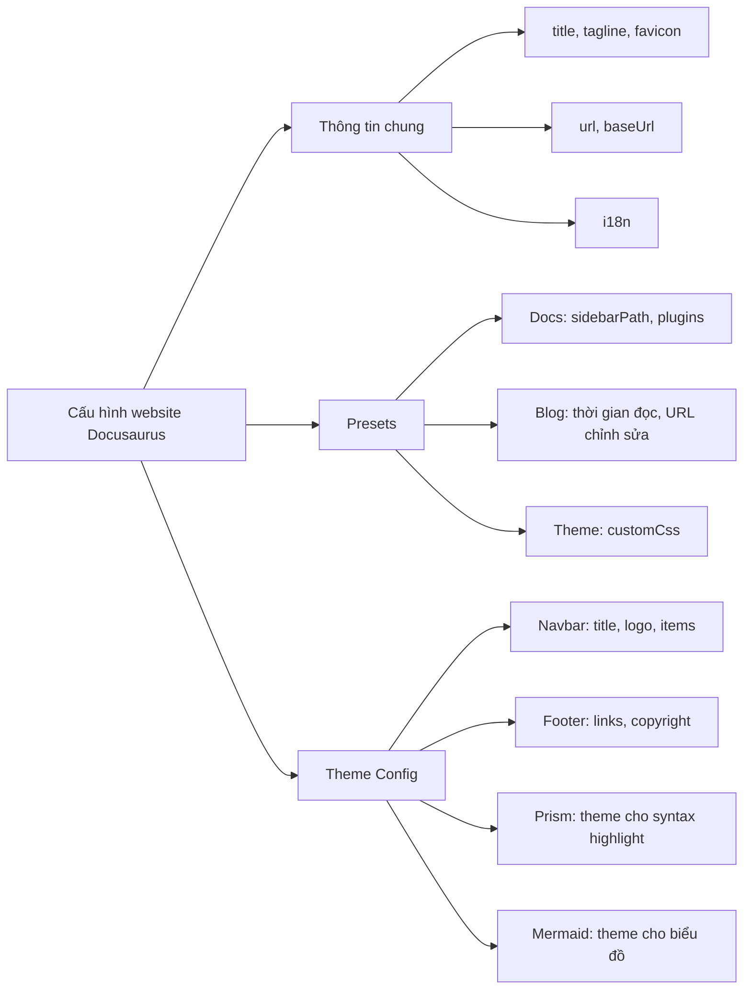

## Tổng Quan
- **Nguyên tắc Kim Tự Tháp** là phương pháp sắp xếp thông tin từ tổng quát đến chi tiết.
- **Ý tưởng chính**: Bắt đầu với khái niệm rộng, sau đó chia nhỏ thành các phần chi tiết hơn, tạo cấu trúc rõ ràng và dễ hiểu.
- **Lợi ích**:
  - Giúp xử lý thông tin phức tạp dễ dàng hơn.
  - Cho phép người dùng nắm bắt toàn cảnh trước khi đi vào chi tiết.
  - Tăng hiệu quả giải quyết vấn đề khi bạn biết rõ thứ tự từng bước cần thực hiện.

## Áp Dụng Kim Tự Tháp vào tùy biến website

:::info "Giới thiệu"
File `docusaurus.config.js` là nơi cấu hình chính của website Docusaurus, chứa nhiều thông tin quan trọng để điều chỉnh giao diện, tính năng và trải nghiệm người dùng. 
Áp dụng Nguyên Tắc Kim Tự Tháp giúp bạn hiểu và chỉnh sửa file này theo cách hiệu quả mà không bị choáng ngợp nhất là khi bạn chưa có kinh nghiệm lập trình từ trước.
:::

### Sơ đồ cấu trúc  file cấu hình

:::success "Gợi ý"
Khi mở file `docusaurus.config.js` hoặc bất kỳ file dòng lệnh nào, bạn luôn có thể thu gọn, mở rộng nội dung bên trong bằng cách click vào mũi tên ở dòng đánh số tương ứng trong giao diện Visual Studio Code.
:::

Dưới đây là cấu trúc khái quát của file, đã chỉnh sửa đôi chút so với file nguyên bản khi cài đặt lần đầu.
Với sơ đồ này, bạn hãy tập trung vào nhóm thông tin mình cần chỉnh sửa, tùy biến và thu gọn các dòng lệnh không liên quan để giảm tải thông tin.

### Áp Dụng Kim Tự Tháp vào cấu hình file docusaurus.config.js

1. **Bắt đầu từ tổng thể** – Xác định các phần chính trong file.
   - **Các thành phần chính của file**:
     - **Thông tin chung**: Cấu hình cơ bản như tiêu đề, tagline, URL, favicon.
     - **Presets**: Cấu hình các gói mặc định (docs, blog, theme).
     - **Theme Config**: Tùy chỉnh giao diện, bao gồm navbar, footer, prism, và các cài đặt theme.

2. **Chia nhỏ thành phần** – Bắt đầu với từng phần chính, sau đó đi sâu vào các chi tiết cụ thể.
   - **Thông tin chung**: Cài đặt những thông tin cơ bản về trang như `title`, `tagline`, và `baseUrl`.
   - **Presets**: Tùy chỉnh preset cho docs, blog và theme (chọn các plugin và cấu hình sidebar, custom CSS).
   - **Theme Config**: Điều chỉnh từng thành phần giao diện như `navbar` (logo, items), `footer` (liên kết, copyright), và `prism` (theme cho syntax highlight).

3. **Thực hiện từng bước** – Mở rộng hoặc thu gọn từng phần, chỉnh sửa từng yếu tố nhỏ để dễ kiểm soát.
   - Ví dụ: Khi muốn thêm logo, chỉ cần mở phần `navbar` trong `Theme Config` và chỉ chỉnh sửa phần `logo`.
   - Hoặc, nếu muốn cài đặt thêm plugin cho Markdown, tìm `presets` và thêm vào phần `remarkPlugins` hoặc `rehypePlugins`.

## Kết Luận

- **Áp dụng Nguyên Tắc Kim Tự Tháp vào `docusaurus.config.js`** giúp bạn dễ dàng tiếp cận và chỉnh sửa từng phần của file.
- **Lợi ích**: Cho phép bạn hiểu rõ tổng thể cấu hình trước khi đi sâu vào từng chi tiết, giúp quá trình chỉnh sửa hiệu quả và có tổ chức.
- **Hành động cụ thể**: Mở từng phần cần chỉnh sửa (navbar, footer, prism...) thay vì làm tất cả một lúc, giúp quản lý file tốt hơn và tránh lỗi.